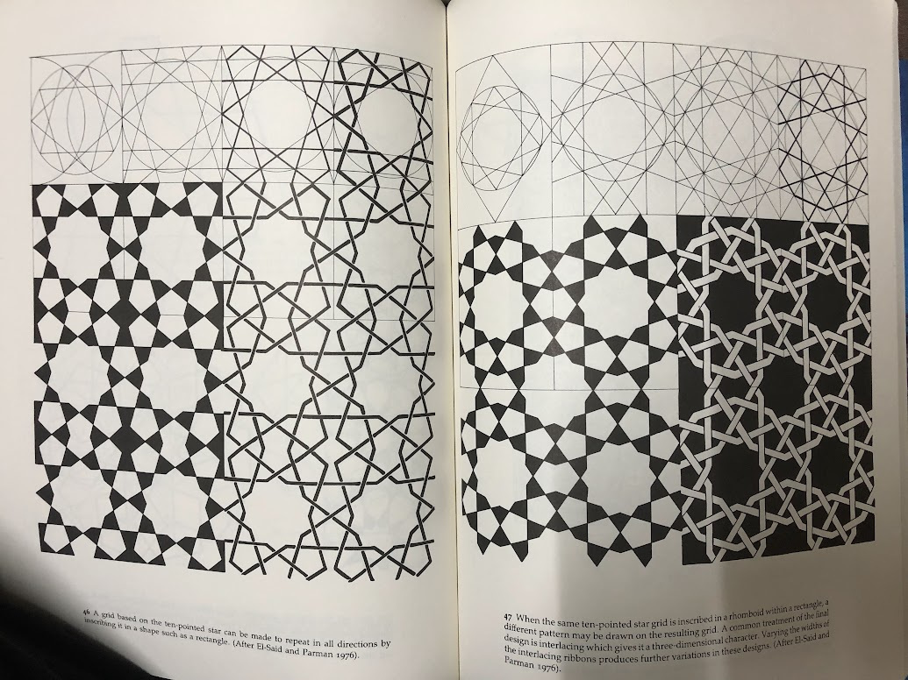
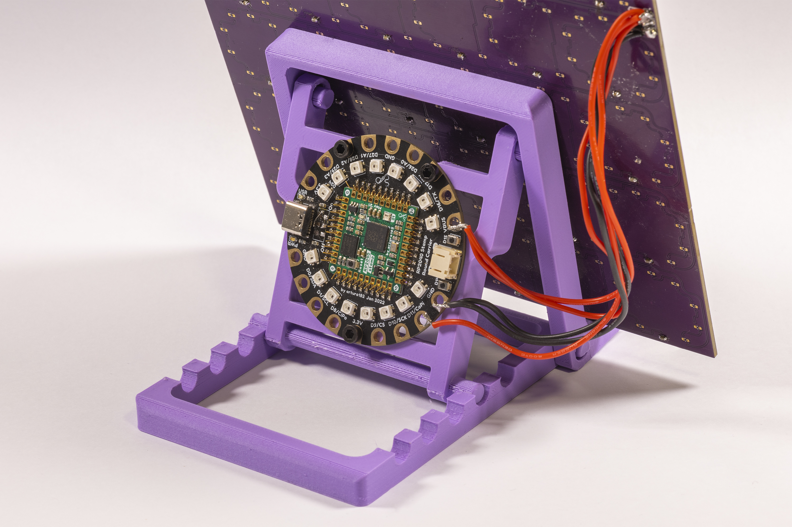
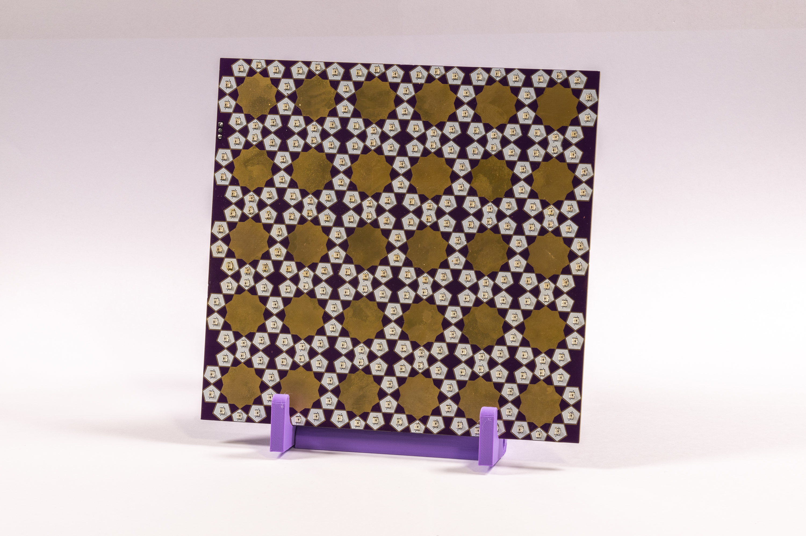

# Period Tracking and Moon Phase Calendar

_By Anuradha Reddy and arturo182_

Correspondence email: anu@duck.com

Twitter: @anu1905, @arturo182

Mastodon: @anu1905@post.lurk.org, @arturo182@mastodon.social

This project manifested at the time of the overturning of the Roe v. Wade legislation (USA, June 2022). As the news spread like wildfire, menstruating people worldwide were quickly advised to delete their period-tracking data from private apps and devices. The news told people to hide their period data from doctors (even partners) to avoid future incrimination around one’s right to abortion. Shocked and angry, I [Anuradha] needed an outlet, and what better outlet than making?

*A moving GIF image of a printed circuit board that switches on and off between visualising moon phases and a menstruation cycle. Photographed by arturo182*
  
A month or so before the news hit, I took an online Islamic geometry course ([by Samira Mian](https://www.samiramian.uk/)). Soon after, I began experimenting with the patterns in [code](https://anuradhareddy.com/Ferozkoh-Jaali) (p5js). The code got me thinking about translating the patterns into hardware, and I proposed this idea to arturo182. Inspired by [Jason Coon’s](https://twitter.com/jasoncoon_/status/1589403833910063104?s=20) LED CycloHex patterns, we attempted an LED Islamic geometry-inspired board. We chose the 10-pointed star from a [pattern book](https://www.amazon.com/Islamic-Designs-Artists-Craftspeople-Pictorial/dp/048625819X) I found in my late grandfather’s dusty library on my last visit to India.

*Two pages from an Islamic geometry pattern book showing the process of making a ten-pointed star grid inside a rectangle.*

The ten-pointed star was an easy pattern to replicate and tessellate with digital software. arturo182 designed the entire circuit board from scratch in KiCad. It incorporated addressable surface mount LEDs – ten LEDs for each star unit in a 6x5 grid (30 units - 250 LEDs). We consulted each other on the look and feel of the board: purple solder mask, white silkscreen and gold for the traditional art of Islamic illumination. At the time, we aimed to experiment with NeoPixel libraries and play with LED animations. We wanted to have fun and make a pretty board but had no idea about the new direction the project was taking.

*A zoomed-in view of the 10-pointed star pattern on the printed circuit board. The board has purple solder mask, white silkscreen and gold in the centre for illumination. Photographed by arturo182*
 
Soon the most beautiful Islamic geometry-inspired circuit board was in our hands. We hooked it up to [Solder Party’s RP2040 Stamp Round Carrier](https://lectronz.com/products/rp2040-stamp-round-carrier) and used CircuitPython to program it. But I was far from satisfied with the blinky LED animation trains, which I thought took the focus away from the timeless artform on the circuit board. I wanted to make its appearance delicate, drawing attention to the art. 

*The back side of the Islamic geometry circuit board consists of a 3D-printed stand made with purple PLA for the board to lean on. The stand holds the 2040 Stamp Round Carrier board which is connected to the main board. Photographed by arturo182*

Meanwhile, my obsession with Islamic geometry grew, and I learned all sorts of interesting meanings and symbolisms embodied in the artform – symmetry, unity, harmony, and balance. By drawing connections to symmetrical natural cycles sacred to many cultures and practices, I landed on experimenting with moon phases on the board. arturo182 helped manually program each unit of ten LEDs using a coded array to reflect four phases of the moon (first-quarter, full moon, third-quarter, new moon). The total grid of 30 ten-pointed stars allowed us to visualize the board as a monthly moon phase calendar. Another silver lining was learning that lunar months alternate between 29-30 days, i.e., we could ignore months with 31 days. We initially chose white (#FFFFFF) for the LEDs representing the moon phases (the new moon phase was on a dimmer setting to indicate a fresh start). The board looked beautiful, but it still felt scant. It needed something more.

*A printed circuit board (PCB) with LEDs arranged in an Islamic geometry pattern repeating in a 6x5 grid. Photographed by arturo182*
  
With the overturning of the Roe v. Wade legislation, it didn’t take me long to imagine my monthly period tracking data alongside the moon phase calendar. This was when the project came together. I manually programmed the LEDs to reflect the two natural cycles in delectable twilight colours: #330019 - period tracking and #190033 - moon phases. It made sense to bring more beauty to these natural cycles and to see them together – a way to push back against the misogyny surrounding our female bodies. Even better, seeing my period days overlap with the moon phases gave me a feeling for when my next cycle will arrive. Despite being a manual process of updating the board each month, I feel more empowered to visualize my cycle, locally and privately, than hide it from those who wish to take control of female bodies and their data. 

*A printed circuit board for visualising moon phases and a menstruation cycle. The board's design consists of LEDs arranged in Islamic geometry pattern with ten-pointed star units in a 6x5 grid (30 units in total). Some LED units are lit up to show the moon phases in purple and menstruation days in pinkish red. Photographed by arturo182*

## License information
The Islamic geometry board hardware design is licensed under the **CERN Open Hardware Licence**.

This documentation is licensed under the **CC-BY-SA-4.0 License**.
